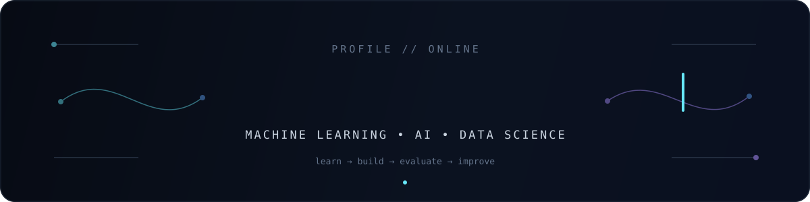

<div align="center">



<br/>

**BSc Information Technology · Machine Learning · AI · Data Science**

<sub>Learning the foundations. Building the systems. Documenting the process.</sub>

</div>

<br/>

## `> whoami`

```python
class MandlaMathobela:
    degree = "BSc Information Technology"
    direction = "Machine Learning & AI Engineering"

    interests = (
        "machine learning",
        "data science",
        "generative AI",
        "intelligent software",
    )

    current_goal = "Turn data into useful systems."
```

I'm an IT student building toward **Machine Learning and AI Engineering**.

What interests me most isn't just training a model. It's understanding the full path from messy data to something that can make a useful prediction, answer a question, or become part of a real product.

```text
raw data  →  understand  →  prepare  →  model  →  evaluate  →  build  →  improve
```

This profile is where I keep that process visible.

---

## `> current_focus`

<table>
<tr>
<td width="50%" valign="top">

### Machine Learning

- supervised learning
- classification & regression
- feature engineering
- model evaluation
- ML pipelines

</td>
<td width="50%" valign="top">

### Data Science

- exploratory data analysis
- statistics & probability
- data cleaning
- visualization
- finding useful patterns in data

</td>
</tr>
<tr>
<td width="50%" valign="top">

### AI Systems

- LLM applications
- RAG
- embeddings
- vector search
- intelligent assistants

</td>
<td width="50%" valign="top">

### Engineering

- Python
- FastAPI
- SQL
- Git / GitHub
- React & React Native
- Supabase / Firebase

</td>
</tr>
</table>

---

## `> project_lab`

I learn best when there is something to build at the end of the theory.

The four projects below are the work I want this profile to be judged by.

<!-- Replace these placeholders with the real repositories. -->

|  | Project | What it explores |
|---|---|---|
| `01` | **Project One** | Machine learning · prediction · model evaluation |
| `02` | **Project Two** | Data analysis · visualization · insight |
| `03` | **Project Three** | AI · retrieval · LLM application |
| `04` | **Project Four** | Software engineering · real-world product |

> Repositories, results and demos will live here as the projects are published.

---

## `> how_i_think_about_ml`

```text
                           ┌──────────────┐
                           │   problem    │
                           └──────┬───────┘
                                  │
                                  ▼
     ┌──────────┐          ┌──────────────┐
     │   data   │ ───────► │ understand   │
     └──────────┘          └──────┬───────┘
                                  │
                         ┌────────┴────────┐
                         ▼                 ▼
                    experiment         measure
                         │                 │
                         └────────┬────────┘
                                  ▼
                           ┌──────────────┐
                           │    model     │
                           └──────┬───────┘
                                  │
                                  ▼
                           ┌──────────────┐
                           │   product    │
                           └──────────────┘
```

A notebook is useful for learning. My longer-term goal is to understand what it takes to move from the notebook to a **reliable system people can actually use**.

---

## `> toolbox`

**Languages**  
`Python` · `SQL` · `JavaScript` · `C++`

**Data / ML**  
`Pandas` · `NumPy` · `Scikit-learn` · `Matplotlib` · `Jupyter`

**Building**  
`FastAPI` · `React` · `React Native` · `Expo` · `Supabase` · `Firebase`

**Workflow**  
`Git` · `GitHub` · `VS Code`

---

## `> learning_log`

```text
NOW       strengthen ML + statistics foundations
 │
 ├──►     build end-to-end ML projects
 │
 ├──►     deepen neural networks / deep learning
 │
 ├──►     deploy models behind APIs
 │
 └──►     build production-minded AI systems
```

I'm deliberately treating this as a progression rather than a list of technologies to collect.

---

## `> build_loop`

<div align="center">

```text
learn  →  build  →  test  →  break  →  debug  →  understand  →  build again
```

<sub>Still training. Always shipping something.</sub>

</div>
